#### 5.1.1.1 [Typora(.md)文档导出为Word-使用pandoc工具](https://www.cnblogs.com/fancy2022/p/16365046.html)

#### 5.1.1.2 1 场景

今天使用typora写了一篇带有很多图片的文章，由于同事领导都使用的是Word，因此需要把Markdown转为Word文件

之前都是直接复制，因为这次有大量图片，直接复制无法满足需求

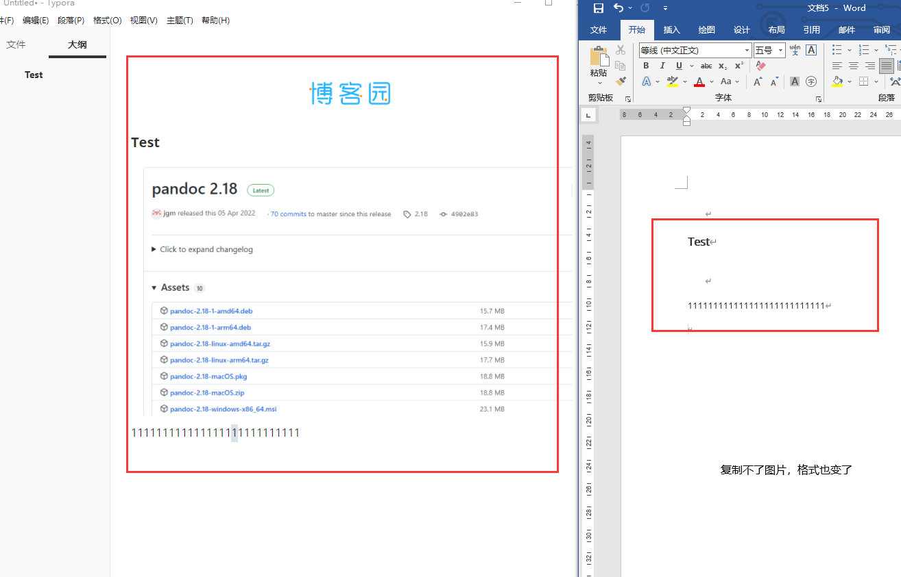

##### 5.1.1.2.1 Markdown介绍

Markdown 是一种轻量级标记语言，它允许人们使用易读易写的纯文本格式编写文档。

Markdown 语言在 2004 由约翰·格鲁伯（英语：John Gruber）创建。

Markdown 编写的文档可以导出 HTML 、Word、图像、PDF、Epub 等多种格式的文档。

Markdown 编写的文档后缀为 .md, .markdown。

##### 5.1.1.2.2 Typora介绍与下载

Typora编辑器让人们能更简单地用Markdown语言书写文字，解决了使用传统的Markdown编辑器写文的痛点，并且界面简洁优美，实现了实时预览等功能。

Typora官网： https://typora.io/

windos版本下载地址：https://typora.io/#windows

#### 5.1.1.3 2 解决方法

点击文件-导出-word

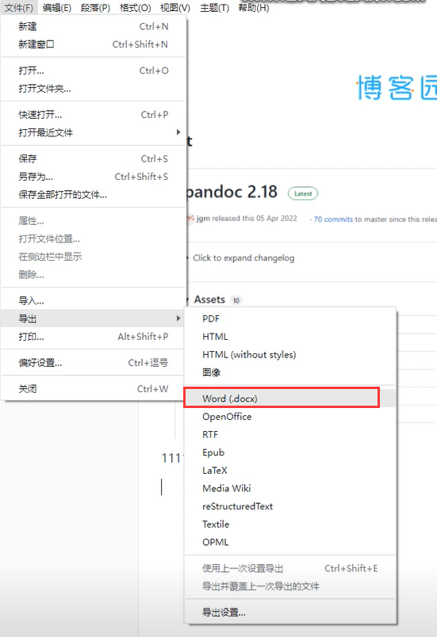

会提示安装pandoc

安装好pandoc点击右边设置好pandoc.exe路径后即可顺利导出

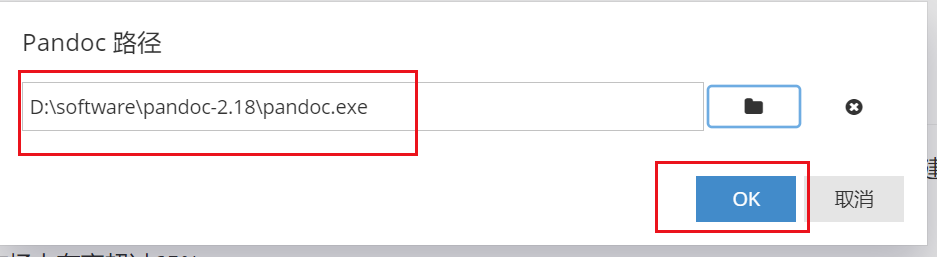

#### 5.1.1.4 3 pandoc安装方法

##### 5.1.1.4.1 pandoc介绍

Pandoc是一款功能极其强大的格式转换工具，涵盖格式广泛且转换效果好。
像常用的docx、md、tex、html等格式都可以利用其进行相互转化。

##### 5.1.1.4.2 pandoc安装

GitHub地址：https://github.com/jgm/pandoc/releases/tag/2.18

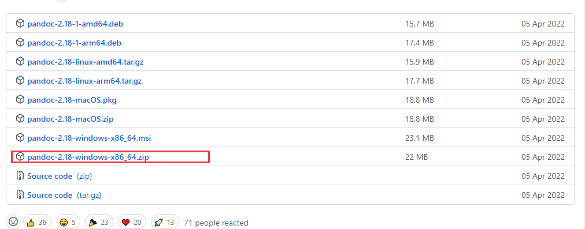

Windows下载这个直接解压即可

#### 5.1.1.5 4 自定义导出的Word样式

如果想改变默认导出Word的样式，如标题、表格、正文样式。可以进行自定义模板设置。

###### 5.1.1.5.1 ①准备Word样式模板

**方式一：新建一个Word文档，按你的需求进行样式修改**

**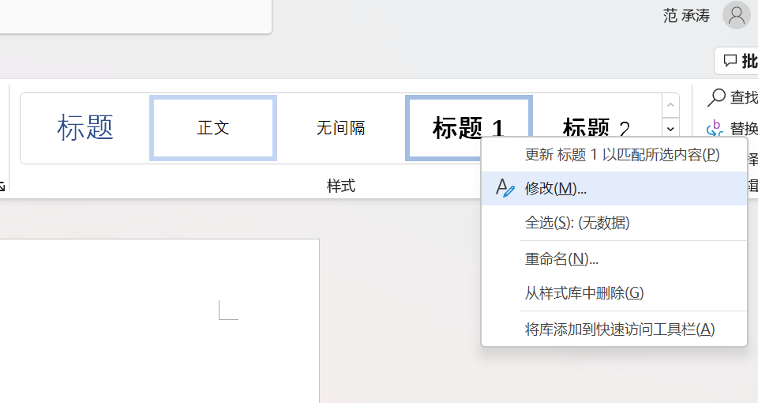**

**方式二：也可以打开一篇之前的Word文档，提取它的样式：**

选择“管理样式”

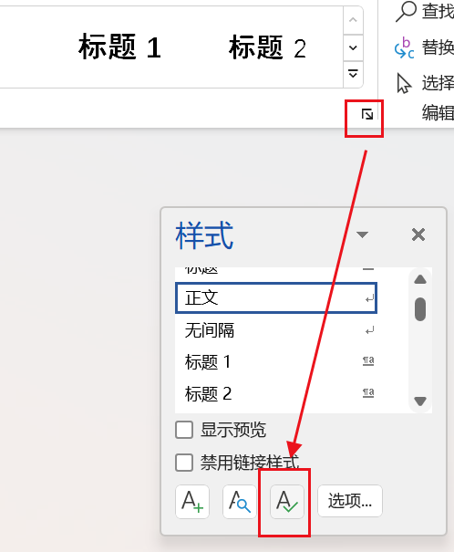

点击导入/导出

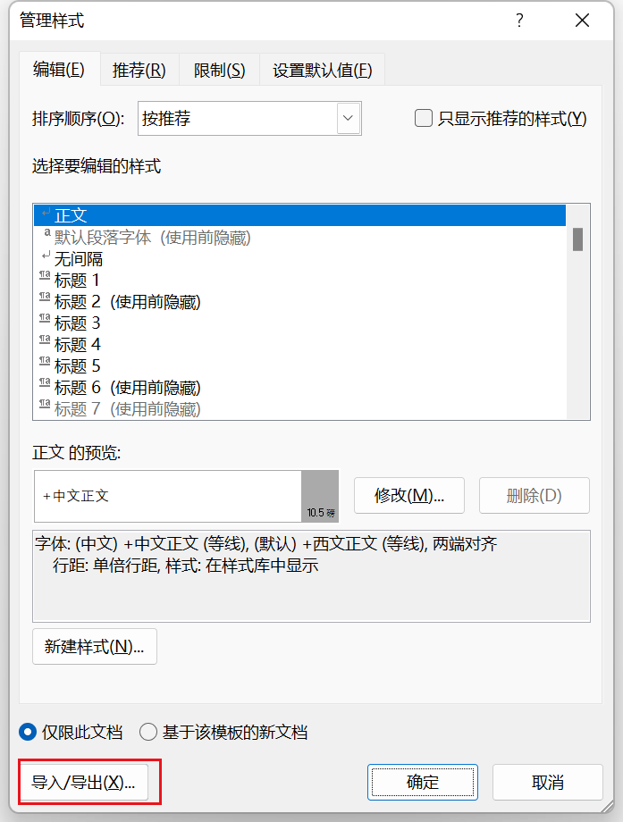

按Ctrl+Alt键，点击左侧批量选择目标样式，复制到公用模板。

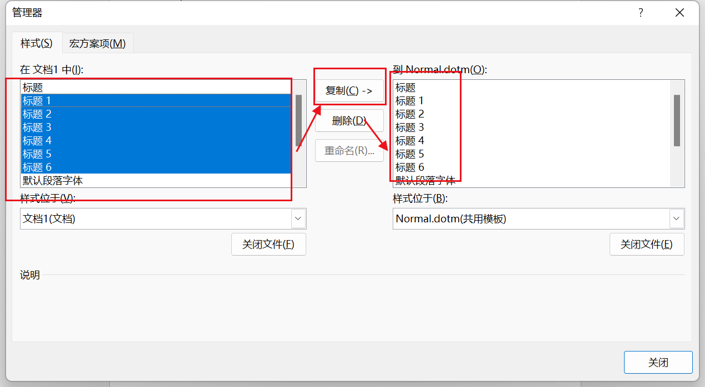

###### 5.1.1.5.2 ②保存Word样式文件

新建空白文档，此文档已经应用了你想要导出的最终样式

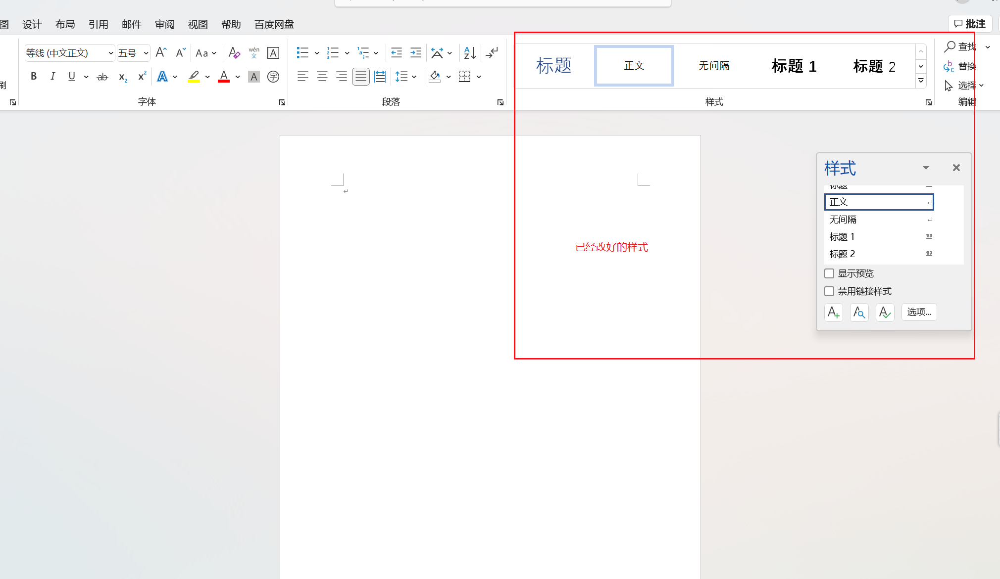

另存为模板文件.docx（注意后缀）

###### 5.1.1.5.3 ③在Typora中导入模板

选择“导出设置”

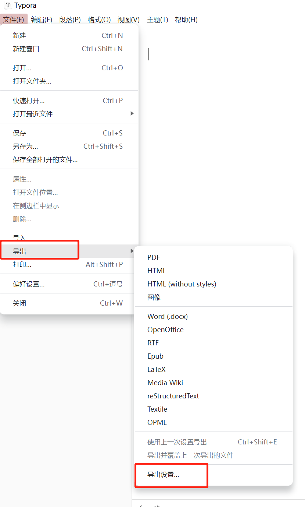

导入刚才保存的带有样式模板的空白Word

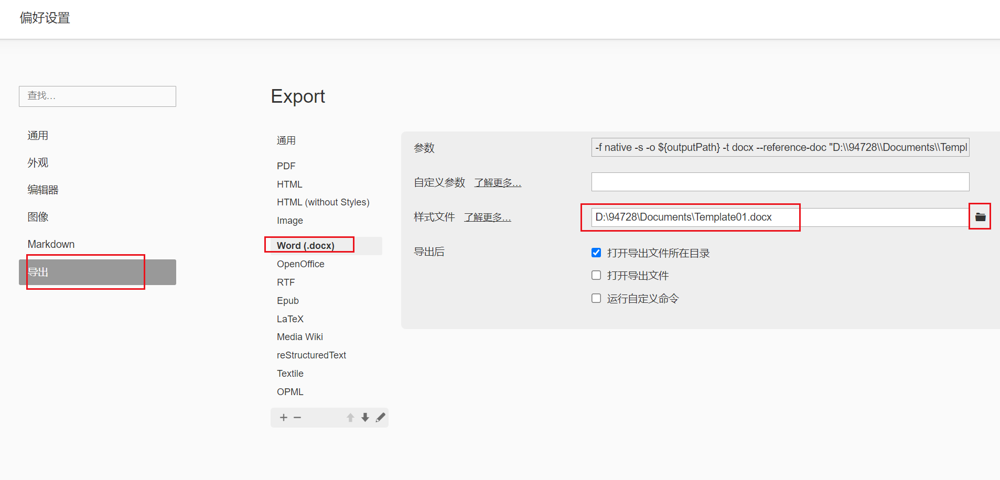

再次导出为word，此时的word就是你自定义的样式了。